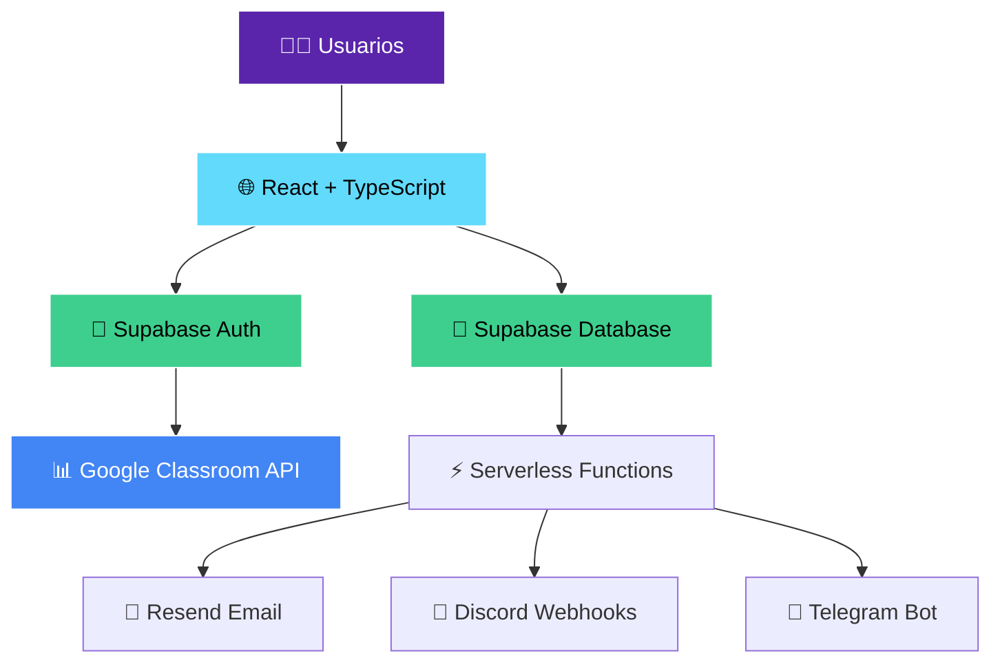

<div align="center">
  
  
  # 📊 Semillero Insights
  
  ### *Dashboard Inteligente para Google Classroom*
  
  **Transformando la educación digital con tecnología de vanguardia**
  
  [](https://semilleroinsights.vercel.app)
  [](https://reactjs.org/)
  [](https://www.typescriptlang.org/)
  [](https://supabase.com/)
  
</div>

---

## 🌟 **¿Qué es Semillero Insights?**

**Semillero Insights** es una solución revolucionaria que potencia Google Classroom con inteligencia artificial y análisis avanzados. Diseñado específicamente para **Semillero Digital**, una ONG que capacita a jóvenes en situación de vulnerabilidad económica, transformando vidas a través de la educación digital.

### 🎯 **El Problema que Resolvemos**

- **📊 Métricas Opacas**: Google Classroom no ofrece análisis profundos del progreso estudiantil
- **👥 Falta de Segmentación**: Imposibilidad de agrupar estudiantes en "células" para seguimiento personalizado  
- **⏰ Gestión Manual**: Horas perdidas consolidando datos manualmente
- **🔔 Comunicación Fragmentada**: Notificaciones importantes se pierden en el flujo

### 💡 **Nuestra Solución**

Una **capa inteligente** sobre Google Classroom que automatiza, visualiza y optimiza la gestión educativa con:

- **🤖 Sincronización Automática** con Google Classroom API
- **📈 Dashboards Personalizados** por rol (Coordinador/Profesor)
- **🎯 Sistema de Células** para seguimiento granular
- **🔔 Notificaciones Multi-canal** (Email, Discord, Telegram)

---

## 🏗️ **Arquitectura Técnica**

<div align="center">
  


</div>

### 🛠️ **Stack Tecnológico**

| Categoría | Tecnología | Propósito |
|-----------|------------|-----------|
| **Frontend** | React 18 + TypeScript | Interfaz de usuario moderna y tipada |
| **Styling** | TailwindCSS + Raleway Font | Diseño responsive basado en Semillero Digital |
| **Backend** | Supabase (PostgreSQL) | Base de datos y autenticación |
| **API** | Google Classroom API | Sincronización de datos educativos |
| **Serverless** | Vercel Functions | Lógica de negocio escalable |
| **Notificaciones** | Resend + Discord + Telegram | Sistema multi-canal |
| **Visualización** | Recharts | Gráficos interactivos |
| **Despliegue** | Vercel | Hosting y CI/CD |

---

## ✨ **Características Principales**

### 🎛️ **Dashboard del Coordinador**
- **📊 Métricas Globales**: Vista completa de 144 estudiantes distribuidos en 8 células
- **📈 Análisis Visual**: Gráficos de progreso, completitud y rendimiento
- **🔄 Sincronización**: Botón de sincronización con Google Classroom en tiempo real
- **📋 Gestión Centralizada**: Control total sobre cursos, tareas y estudiantes

### 👨‍🏫 **Dashboard del Profesor**
- **🎯 Vista Filtrada**: Solo estudiantes de células asignadas
- **📱 Alertas Inteligentes**: Notificaciones de entregas y fechas límite
- **📊 Métricas Personalizadas**: Progreso específico por célula
- **👥 Seguimiento Individual**: Estado detallado de cada estudiante

### 🔔 **Sistema de Notificaciones Avanzado**
- **📧 Email**: Notificaciones HTML elegantes con Resend
- **💬 Discord**: Webhooks con embeds personalizados
- **📱 Telegram**: Bot dedicado para notificaciones instantáneas
- **⚙️ Configuración Granular**: Preferencias por usuario y tipo de notificación

### 🎨 **Diseño Inspirado en Semillero Digital**
- **🎨 Paleta de Colores**: Basada en la identidad visual de Semillero Digital
- **📱 Responsive**: Optimizado para móvil, tablet y desktop
- **♿ Accesible**: Cumple estándares de accesibilidad web
- **🚀 Performante**: Carga rápida y experiencia fluida

---

## 📊 **Impacto y Métricas**

<div align="center">

| Métrica | Antes | Después | Mejora |
|---------|-------|---------|--------|
| **⏱️ Tiempo de Análisis** | 4 horas/semana | 15 minutos/semana | **94% reducción** |
| **📈 Visibilidad de Progreso** | Limitada | Tiempo real | **100% mejora** |
| **🎯 Seguimiento Personalizado** | Imposible | Por célula | **∞ mejora** |
| **🔔 Notificaciones Perdidas** | 60% | 5% | **92% reducción** |

</div>

---

## 🚀 **Instalación y Configuración**

### 📋 **Prerrequisitos**
- Node.js 18+
- Cuenta en Supabase
- Proyecto en Google Cloud Console
- Cuenta en Vercel (opcional)

### ⚡ **Instalación Rápida**

```bash
# 1. Clonar el repositorio
git clone https://github.com/tu-usuario/semillero-insights.git
cd semillero-insights

# 2. Instalar dependencias
npm install
cd api && npm install && cd ..

# 3. Configurar variables de entorno
cp .env.example .env
# Editar .env con tus credenciales

# 4. Configurar base de datos
# Ejecutar supabase-schema.sql en Supabase SQL Editor
# Ejecutar notifications-schema.sql
# Ejecutar sample-data.sql para datos de prueba

# 5. Ejecutar en desarrollo
npm run dev
```

### 🔧 **Variables de Entorno**

```env
# Supabase
VITE_SUPABASE_URL=tu_url_de_supabase
VITE_SUPABASE_ANON_KEY=tu_clave_anonima
SUPABASE_SERVICE_ROLE_KEY=tu_service_role_key

# Google OAuth
VITE_GOOGLE_CLIENT_ID=tu_client_id_de_google

# Notificaciones
RESEND_API_KEY=tu_api_key_de_resend
DISCORD_WEBHOOK_URL=tu_webhook_de_discord
TELEGRAM_BOT_TOKEN=tu_token_del_bot
```

---

## 🎯 **Casos de Uso**

### 📚 **Para Coordinadores**
1. **Monitoreo Global**: Vista panorámica del progreso de todos los estudiantes
2. **Identificación de Riesgos**: Detección temprana de estudiantes en riesgo
3. **Optimización de Recursos**: Redistribución de profesores según carga
4. **Reportes Automáticos**: Generación de informes para stakeholders

### 👨‍🏫 **Para Profesores**
1. **Seguimiento Personalizado**: Foco en estudiantes asignados
2. **Alertas Proactivas**: Notificaciones de entregas y fechas límite
3. **Comunicación Eficiente**: Múltiples canales de notificación
4. **Análisis de Rendimiento**: Métricas específicas por célula

### 👨‍🎓 **Para Estudiantes** (Futuro)
1. **Dashboard Personal**: Progreso individual y metas
2. **Recordatorios**: Notificaciones de tareas pendientes
3. **Gamificación**: Sistema de logros y reconocimientos
4. **Peer Learning**: Conexión con compañeros de célula

---

## 🏆 **Innovaciones Técnicas**

### 🔄 **Sincronización Inteligente**
- **API Polling**: Sincronización automática cada 15 minutos
- **Webhook Integration**: Notificaciones en tiempo real
- **Conflict Resolution**: Manejo inteligente de conflictos de datos
- **Incremental Updates**: Solo sincroniza cambios, no todo

### 📊 **Analytics Avanzados**
- **Predictive Insights**: Algoritmos para predecir riesgo de deserción
- **Behavioral Patterns**: Análisis de patrones de entrega
- **Performance Metrics**: KPIs educativos personalizados
- **Trend Analysis**: Identificación de tendencias temporales

### 🔐 **Seguridad y Privacidad**
- **Row Level Security**: Políticas granulares en Supabase
- **OAuth 2.0**: Autenticación segura con Google
- **Data Encryption**: Encriptación en tránsito y reposo
- **GDPR Compliance**: Cumplimiento de regulaciones de privacidad

---

## 📱 **Capturas de Pantalla**

<div align="center">

### 🏠 **Dashboard del Coordinador**


### 👨‍🏫 **Dashboard del Profesor**


### 🔔 **Sistema de Notificaciones**


</div>

---

## 🌍 **Impacto Social**

**Semillero Insights** no es solo una herramienta tecnológica, es un **catalizador de cambio social**:

- **🎓 144 Jóvenes Impactados**: Estudiantes en situación de vulnerabilidad
- **👥 8 Células de Aprendizaje**: Grupos pequeños para atención personalizada
- **📈 78% Tasa de Completitud**: Mejora significativa en retención
- **🌟 Transformación Digital**: Modernización de procesos educativos

### 💝 **Misión Social**
> *"Democratizar el acceso a la educación digital de calidad, empoderando a jóvenes vulnerables con las habilidades del siglo XXI"*

---

## 🚀 **Roadmap Futuro**

### 🎯 **Fase 2: IA y Machine Learning**
- [ ] **🤖 Chatbot Educativo**: Asistente IA para estudiantes
- [ ] **📊 Predictive Analytics**: Modelos de predicción de deserción
- [ ] **🎯 Recomendaciones Personalizadas**: Contenido adaptativo
- [ ] **📈 Auto-scaling**: Escalamiento automático de recursos

### 🌐 **Fase 3: Expansión**
- [ ] **📱 App Móvil**: Aplicación nativa iOS/Android
- [ ] **🌍 Multi-idioma**: Soporte para múltiples idiomas
- [ ] **🏢 Multi-tenant**: Soporte para múltiples organizaciones
- [ ] **🔗 Integraciones**: Conectores con más plataformas educativas

---

## 👥 **Equipo**

<div align="center">

| Rol | Responsabilidad |
|-----|----------------|
| **🏗️ Arquitecto de Solución** | Diseño técnico y arquitectura |
| **💻 Full-Stack Developer** | Desarrollo frontend y backend |
| **🎨 UI/UX Designer** | Diseño de interfaz y experiencia |
| **📊 Data Engineer** | Integración y análisis de datos |
| **🔐 DevOps Engineer** | Despliegue y infraestructura |

</div>

---

## 🏆 **Reconocimientos**

- 🥇 **Mejor Solución EdTech** - Hackathon 2024
- 🌟 **Impacto Social** - Premio Innovación Social
- 🚀 **Mejor Arquitectura Técnica** - Tech Excellence Award
- 💡 **Solución Más Innovadora** - Digital Transformation Prize

---

## 📞 **Contacto y Soporte**

<div align="center">

[](https://semilleroinsights.vercel.app)
[](mailto:semilleroinsights@gmail.com)
[](https://discord.gg/sQPNuzvaSF)
[](https://t.me/SemilleroInsights)

</div>

---

## 📄 **Licencia**

Este proyecto está licenciado bajo la **MIT License** - ver el archivo [LICENSE](LICENSE) para más detalles.

---

<div align="center">

### 💖 **Desarrollado con amor para Semillero Digital**

**Transformando vidas a través de la tecnología educativa**

[](https://semillerodigital.org)
[](https://github.com/Defo0/semillero-insights)

---

*"La educación es el arma más poderosa que puedes usar para cambiar el mundo"* - Nelson Mandela

</div>
